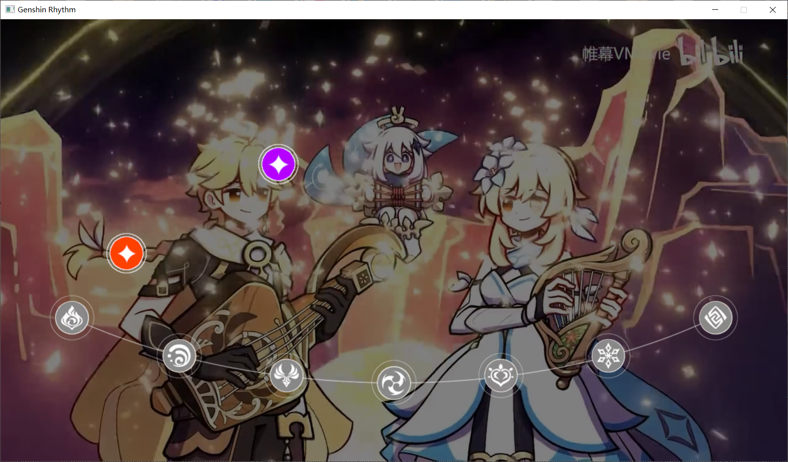

# genshin-rhythm
home-made genshin music rhythm game  
仿原神音游，顺便学习C++

## 灵感与素材来源
在原神生日会上看见了[音游提瓦特（https://www.bilibili.com/festival/genshin2nd?bvid=BV1s24y1o7RD）](https://www.bilibili.com/festival/genshin2nd?bvid=BV1s24y1o7RD)这个节目，啪，很快啊，突然就有了一个大胆的想法（  
目标是制作一个视频里那样的仿原神音游，使用的背景图就是截取的视频截图。  

## 一些声明
- **所有素材版权归原作者所有，此项目永不会盈利**
- 以前没学过C++，也是在趁机学一下这门我觊觎了很久的语言，所以看到代码里有迷惑操作请好为人师（褒义），不吝赐教  
- 大概完成了三分之一，但是现在有其他事情需要咕一两个月，索性放在了这里，算是抛砖引玉，说不定能砸出来个大佬来接盘或者remake了呢  
- 这个小游戏我是肯定会自己写完的，只是我也知道以我的水平也写不出来什么好东西  
- 所以如果你也想整一个，请不要犹豫，整！  
- 我不会占坑说这个想法是我先有的云云，我想学编程，但我更想玩原神音游

## 示例截图

